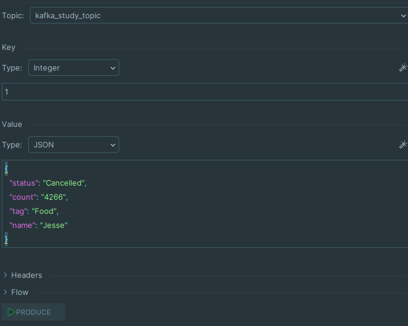
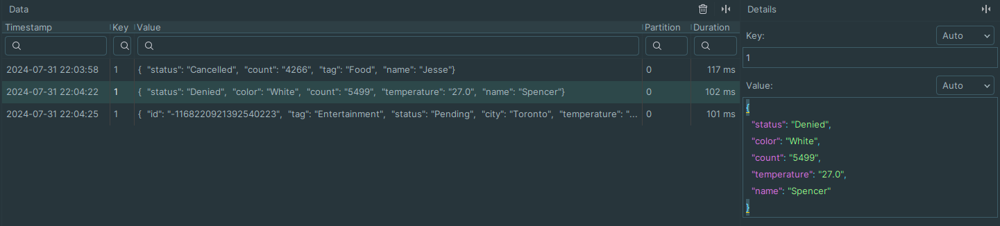

# Kafka

## Запустите Kafka

Для развертывания кластера использовался docker-compose.yaml. Kafka запускалась вместе с zookeeper.

## Отправьте несколько сообщений в топик.

Для отправки сообщений в топик использовался интерфейс IDE.
Можно конечно отправить сообщение и через утилиту, но просто такая отправка сообщений удобнее.

Было отправлено 3 сообщение в топик.
В качестве ключа выступал `int`, ключ был один для всех сообщений, что гарантировало попадание сообщений в одну партицию.

## Прочитайте их, используя графический интерфейс или утилиту kafka-consumer

Далее с использованием графического интерфейса IDE сообщение были прочитаны. 
Пример приведён ниже.

## Отправьте и прочитайте сообщения программно

Для чтения и отправки сообщений программно был реализован скрипт отправки и чтения нескольких сообщений на языке Python
Для контроля версий и зависимостей использовалось `poetry` в качестве библиотеки для работы с kafka использовалось `aiokafka`

Скрипт был выполнен в учебных целях.

Результаты выполнения скрипта представлены ниже.

[Файл с исходным кодом](kafka_example.py)

### Итоги

`Kafka` - мощный инструмент, отличный брокер сообщений. 
Область применения кафки это высоко нагруженные системы. 
Кафка гарантирует порядок сообщений в одном топике.
Достаточно проста в освоении, кроме того есть множество библиотек для различных языков программирования.
